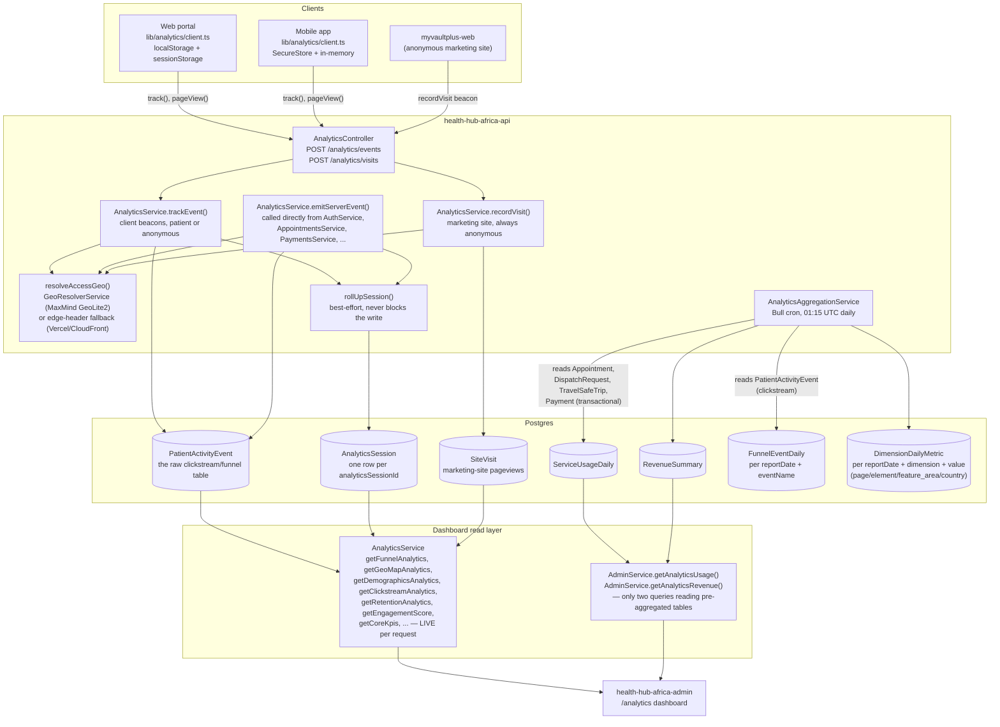

# Patient Portal Analytics Architecture Diagram

Spec §32 deliverable: "Patient Portal Analytics Architecture Diagram." Rendered as Mermaid so it stays in version control and reviewable in a diff, rather than an external design-tool file that drifts silently. Grounded in the actual `AnalyticsService`/`AnalyticsController`/`AnalyticsAggregationService` code; update the diagram in the same PR as any change to the flow it depicts.

## End-to-end flow

## Reading the diagram

- **Three ingestion paths, one shared geo resolver.** `trackEvent` (client beacons), `emitServerEvent` (called directly from service code, no HTTP round-trip — see `docs/ANALYTICS-IDENTITY-SESSIONIZATION-DESIGN.md` §6), and `recordVisit` (the separate marketing-site pageview table) all funnel through the same `resolveAccessGeo()`, so every write gets geo-resolved the same way regardless of entry point.
- **The cron now spans both transactional and clickstream tables.** `AnalyticsAggregationService` aggregates `ServiceUsageDaily`/`RevenueSummary` from the transactional tables (`Appointment`, `DispatchRequest`, `TravelSafeTrip`, `Payment`) and, separately, `FunnelEventDaily`/`DimensionDailyMetric` from `PatientActivityEvent` itself — closing the "cron is an island" gap this diagram originally documented. See `docs/ANALYTICS-EVENT-SCHEMA-AGGREGATION-DESIGN.md` §3 for what's aggregated and why the new tables aren't wired into any dashboard yet.
- **Almost every dashboard still reads live**, despite the aggregates above existing. The `AnalyticsSvc` box represents the bulk of `AnalyticsService`'s public methods, all of which query `PatientActivityEvent`/`AnalyticsSession`/`SiteVisit` directly on every admin-dashboard request — no caching layer, no materialized view. Only `getAnalyticsUsage`/`getAnalyticsRevenue` (in `AdminService`, not `AnalyticsService`) read a pre-aggregated table today; `FunnelEventDaily`/`DimensionDailyMetric` are populated but not yet read by anything, since an unfiltered daily rollup can't simply replace a live query built to support spec §J's arbitrary filter combinations.
- **Identity resolution happens inside `trackEvent`/`emitServerEvent`, not in the diagram's boxes above.** See `docs/ANALYTICS-IDENTITY-SESSIONIZATION-DESIGN.md` for the full patientId/anonymousVisitorId/analyticsSessionId design — this diagram shows data flow, not identity logic.
- **Consent and test-traffic filtering happen inline in `trackEvent`**, before the row is ever written or session-rolled-up (not shown as separate boxes since they're conditionals inside the same function, not separate services) — see `docs/ANALYTICS-PRIVACY-GOVERNANCE.md` §5.

## Related documents

| Document | Covers |
|---|---|
| `docs/ANALYTICS-PRIVACY-GOVERNANCE.md` | Data classification, retention, RBAC, event catalog, consent/test-exclusion |
| `docs/ANALYTICS-KPI-DICTIONARY.md` | Every KPI's formula, exclusions, and refresh interval |
| `docs/ANALYTICS-CLICKSTREAM-MAP.md` | Every tracked page/CTA/element, web and mobile |
| `docs/ANALYTICS-IDENTITY-SESSIONIZATION-DESIGN.md` | How `patientId`/`anonymousVisitorId`/`analyticsSessionId` resolve and stitch |
| `docs/ANALYTICS-EVENT-SCHEMA-AGGREGATION-DESIGN.md` | Full event schema mapping and what each aggregate table covers |
| `geoip/README.md` | GeoIP provider, licensing, and update configuration |
